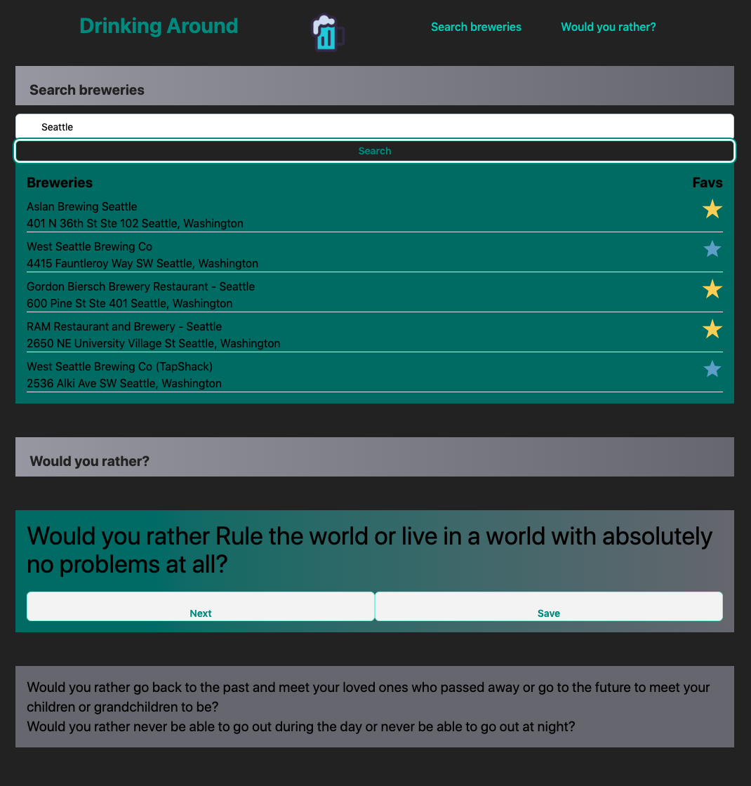

# Drinking-around

## Description
This app is for people who like to drink beer and chat with friends. This app will allow you to find breweries nearby and pull up random topics to playfully argue about. It also allows you to save locations and topic so you can go back to your favorite breweries and topics.

## Usage
To use this app you type in the city you want to look for breweries in and press the search button.
To save breweries simply press the star next to the brewery you wan to save and it will show up the next time you look up that city.

To get a topic just scroll down to the would you rather section and it will have a random would you rather already waiting for you.
To get a new topic just press next and a new random topic will show up.
To save a topic press the save button and it will add to the list of saved topics at the bottom of the page.

## Brewery search

## Credits
empty and filled star = Offnfopt, Public domain, via Wikimedia Commons
 
beer logo = https://www.flaticon.com/free-icon/beer-mug_759969
 
css = https://tailwindcss.com
 
## Apis
brewery api = https://www.openbrewerydb.org/documentation
 
would you rather api = https://would-you-rather-api.abaanshanid.repl.co/home/

## License
Please refer to LICENSE in repository.

## Link

https://ybazail3.github.io/Drinking-around/
